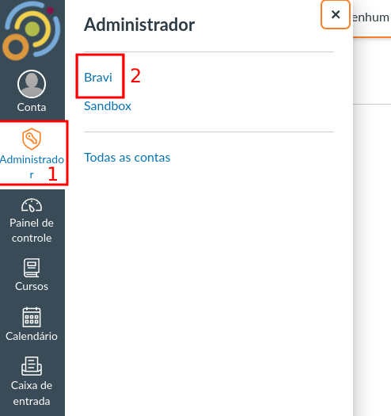
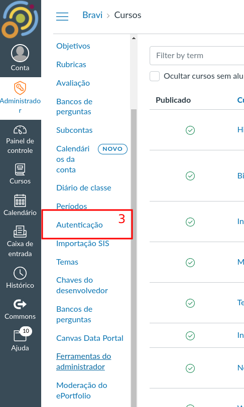
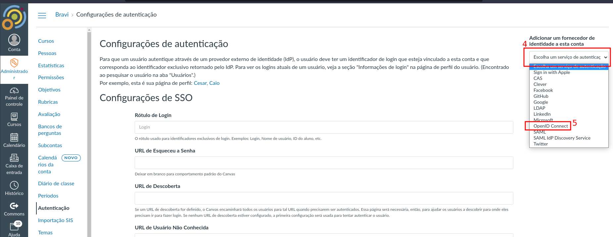
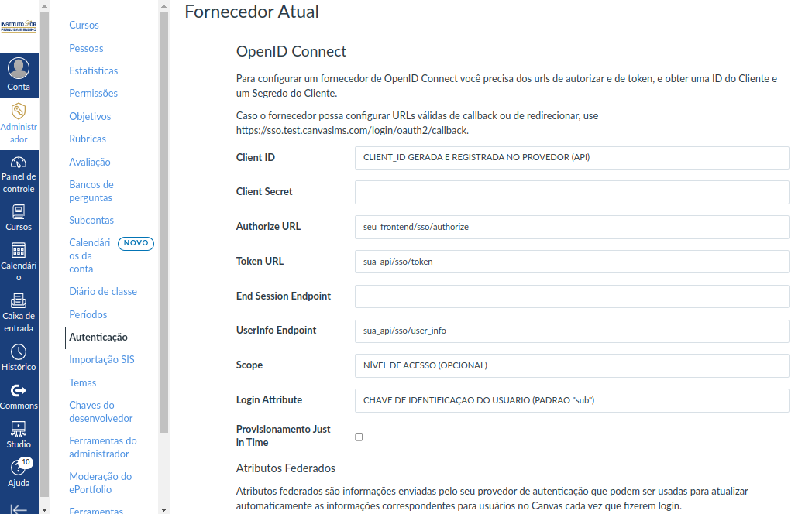
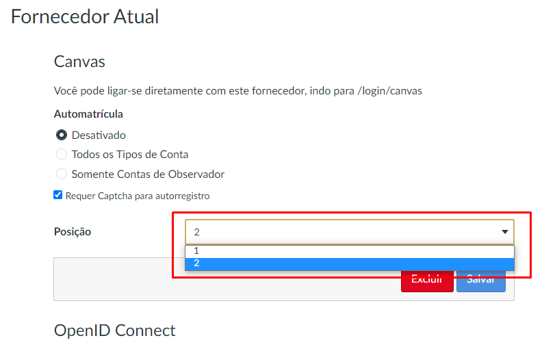

# Registering OpenID Connect Authentication Provider on Canvas

1. Since you have access to an admin account, click the **"Administrador"** button which is on the left side menu and then click the institution name:

2. Next, click the **"Autenticação"** link:

3. Within the new page, you will see a dropdown in the right side with the title **"Adicionar um fornecedor de identidade a esta conta"** above it. Click the dropdown and select **OpenID Connect**:

4. Now, fulfill the fields according to the provider setup in the API and click the **"Salvar"** button:

|Field|Description|Example
|--|--|--|
|Cliend ID|Unique value generated and registered on authentication provider (API)|*client_test*|
|Client Secret|Secret associated with the Client ID. If Client ID has no secret, the field can be empty|*super_secret*|
|Authorize URL|The URL for getting starting the OAuth 2.0 web flow|*your_app_url/sso/authorize*|
|Token URL|The URL for exchanging the OAuth 2.0 authorization code for an Access Token and ID Token|*your_api_url/sso/token*|
|End Session Endpoint|URL to send the end user to after logging out of Canvas. **OPTIONAL**|*your_app_url/login*|
|UserInfo Endpoint|URL to request additional claims from. If the initial ID Token received from the provider cannot be used to satisfy the login_attribute and all federated_attributes, this endpoint will be queried for additional information. **OPTIONAL**|*your_api_url/sso/user_info*|
|Scope|Space separated additional scopes to request for the token. Note that you need not specify the *'openid'* scope.|  *profile course*|
|Login Attribute|The attribute of the ID Token to look up the user's login in Canvas. Defaults to *'sub'*.|*canvas_unique_id*|

5. By default, a new authentication provider will be added in the last priority position. So, for accessing Canvas through it, the user must access *your_canvas_url/login/auth_provider_type* (ex: *canvas.com/login/openid_connect*).

    - OBS: the first position auth provider will be the one to which the user is sent when accessing the root url (ex: with canvas as the default provider, accessing *canvas.com* would send user to *canvas.com/login/canvas*)

    In order to change the default auth provider, change its position to **1** clicking the **"Posição"** dropdown and click the **"Salvar"** button:

